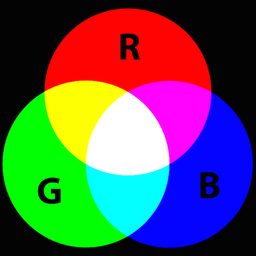
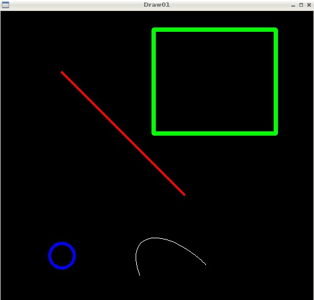

# Computer-Vision And Image Processing

 
The terms "computer vision" and "image processing" are used almost interchangeably in many contexts. They both involve doing some computations on images. But are they really the same thing? Let's talk about what they are, how they are different, and how they are linked to each other.

Image processing focuses on, well, processing images. What this means is that the input and the output are both images. An image processing algorithm can transform images in many ways: smoothing, sharpening, changing the brightness and contrast, highlighting the edges, and so on.

Computer vision, on the other hand, focuses on making sense of what a machine sees. A computer vision system inputs an image and outputs task-specific knowledge, such as object labels and coordinates.

Computer vision and image processing work together in many cases. Many computer vision systems rely on image processing algorithms. For example, computer vision systems rarely use raw imaging data that comes directly from a sensor. Instead, they use images that are processed by an image signal processor.

# Day 1.0
OpenCV reads in images in BGR format (instead of RGB) because when OpenCV was first being developed, BGR color format was popular among camera manufacturers and image software providers. The red channel was considered one of the least important color channels, so was listed last, and many bitmaps use BGR format for image storage. However, now the standard has changed and most image software and cameras use RGB format, which is why, in programs, it's good practice to initially convert BGR images to RGB before analyzing or manipulating any images.

# Day 2.0
Learn to draw different geometric shapes with OpenCV.
using these these functions : cv.line(), cv.circle() , cv.rectangle(), cv.ellipse(), cv.putText() etc.

